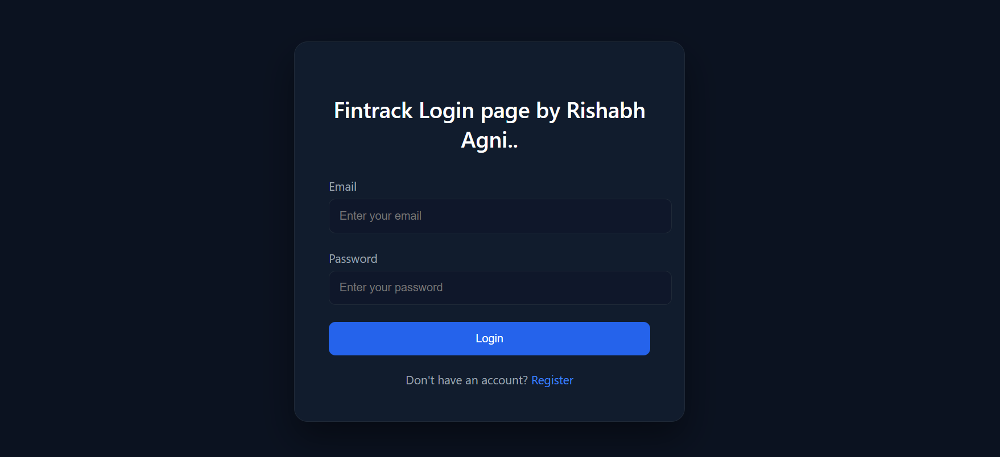
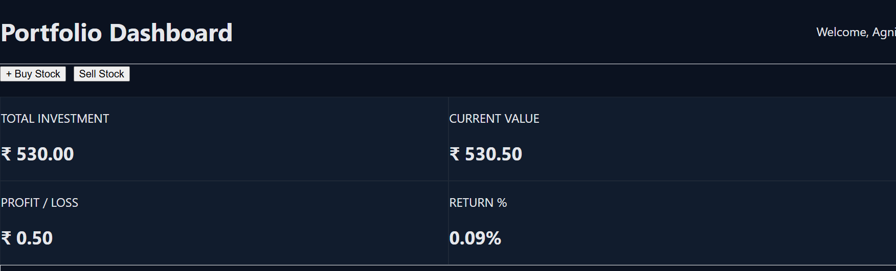
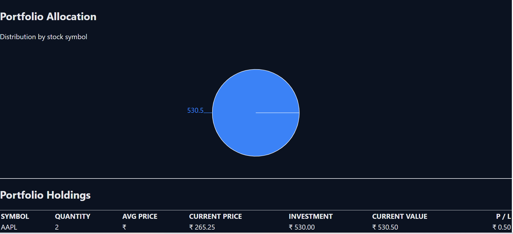
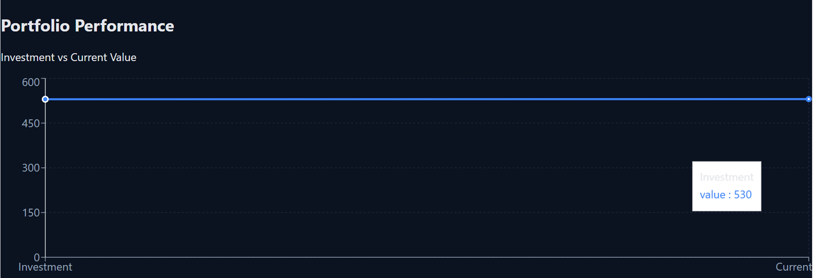

# FinTrack – Real-Time Stock Portfolio Dashboard

FinTrack is a full-stack MERN application that simulates a personal investment dashboard.
It allows users to virtually buy and sell stocks, track portfolio performance in real time, and visualize investment analytics through an interactive dashboard.

The goal of this project was to understand how modern portfolio tracking platforms work and implement a scalable full-stack architecture using real market data and secure authentication.

---

## Project Description

FinTrack provides a clean dashboard where users can manage a virtual stock portfolio and monitor performance metrics such as total investment, current value, profit/loss, and percentage returns.

The application integrates a live stock market API to fetch real-time prices and uses server-side caching to optimize API usage. The frontend focuses on a modern dashboard UI with charts and analytics, while the backend handles authentication, portfolio calculations, and API integration.

---

## Features

* Secure user authentication using JWT
* Virtual stock buying and selling system
* Real-time stock price integration via Finnhub API
* Portfolio analytics (investment value, current value, profit/loss, returns)
* Interactive dashboard with performance and allocation charts
* Responsive UI with a modern dashboard layout
* Protected routes and persistent login sessions

---

## Screenshots

### Login Page



### Dashboard



### Portfolio Holdings



### Portfolio Analytics



---

## Tech Stack

### Frontend

* React (Vite)
* TailwindCSS
* Axios
* Recharts

### Backend

* Node.js
* Express.js
* MongoDB Atlas
* JWT Authentication

### External API

* Finnhub Stock API (for real-time stock prices)

---

## How to Run the Project Locally

### 1. Clone the Repository

```
git clone https://github.com/your-username/fintrack.git
cd fintrack
```

---

### 2. Setup Backend

```
cd server
npm install
```

Create a `.env` file inside the **server** directory:

```
PORT=5000
MONGO_URI=your_mongodb_connection_string
JWT_SECRET=your_jwt_secret
FINNHUB_API_KEY=your_finnhub_api_key
```

Start the backend server:

```
npm run start
```

Backend runs at:

```
http://localhost:5000
```

---

### 3. Setup Frontend

Open another terminal and run:

```
cd client
npm install
npm run dev
```

Frontend runs at:

```
http://localhost:5173
```

---

## Example Workflow

1. Create an account and login
2. Buy stocks using ticker symbols (AAPL, TSLA, etc.)
3. The system fetches live prices from the Finnhub API
4. Portfolio metrics update automatically
5. Dashboard displays performance and allocation charts
